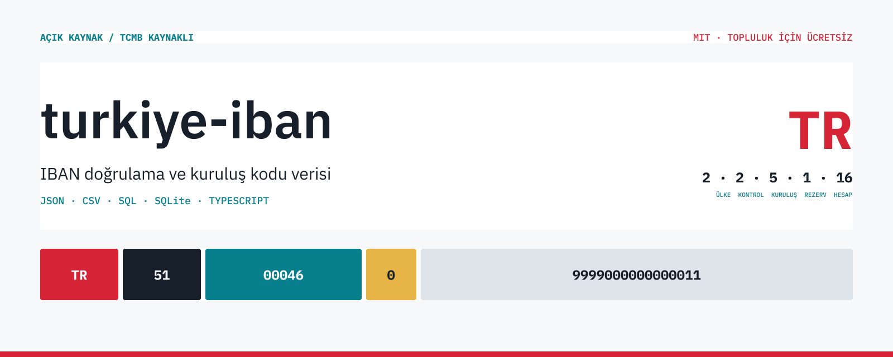
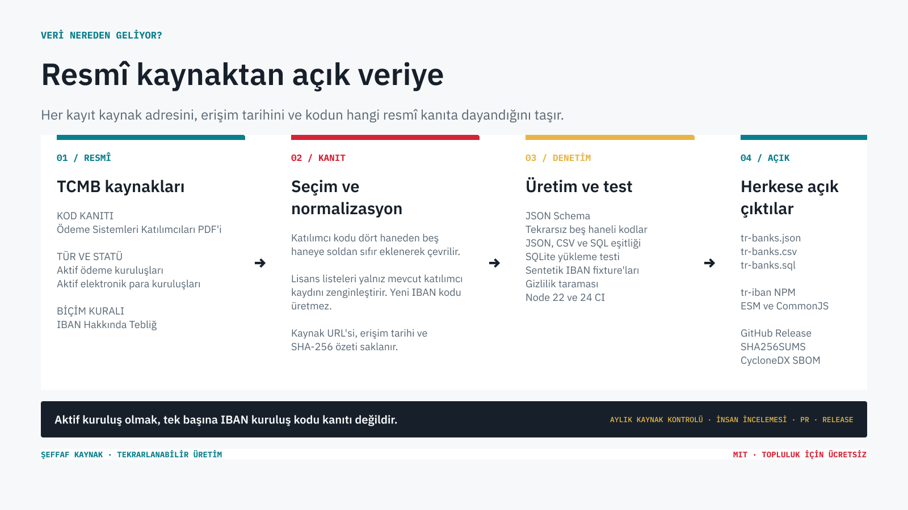

# turkiye-iban



[](https://github.com/trugurpala/turkiye-iban/actions/workflows/ci.yml)
[](https://www.npmjs.com/package/tr-iban)
[](https://github.com/trugurpala/turkiye-iban/releases/latest)
[](LICENSE)
[](https://github.com/trugurpala/divan)

Bu proje, Türkiye'de kullanılan Uluslararası Banka Hesap Numaralarının (IBAN) yazımını kontrol eder ve IBAN içindeki beş haneli kuruluş kodunu Türkiye Cumhuriyet Merkez Bankası (TCMB) verileriyle eşleştirir. Bir kod veri kümesinde bulunduğunda uygulamanız banka veya ödeme kuruluşu alanını otomatik doldurabilir.

> **Önemli sınır**
> Paket bir hesabın gerçekten var olduğunu, kime ait olduğunu veya para transferine açık olduğunu doğrulamaz. Yalnızca IBAN'ın kurallara uygun yazıldığını ve içindeki kuruluş kodunun doğrulanmış veri kümesinde bulunup bulunmadığını kontrol eder.

[Kurulum](#kurulum) · [İlk kullanım](#ilk-kullanım) · [Verinin kaynağı](#verinin-kaynağı) · [Riskler ve sınırlar](docs/RISK_REGISTER.md) · [Veri nasıl hazırlanıyor?](#veri-nasıl-hazırlanıyor) · [Topluluk](#topluluğa-katılın) · [Katkı](#projeye-katkı)

## Ne işe yarar?

Paket bir Türkiye IBAN'ı için şu işlemleri yapar:

- IBAN'ın `TR` ile başladığını ve 26 karakterden oluştuğunu kontrol eder
- Eksik, fazla veya hatalı yazılmış karakterleri tespit eder
- IBAN'ın kontrol rakamlarını matematiksel olarak doğrular
- Beş haneli banka veya ödeme kuruluşu kodunu çıkarır
- Kodu doğrulanmış TCMB katılımcı verisiyle eşleştirir
- IBAN'ı okunabilir biçimde gruplar veya güvenli gösterim için maskeler

## Ne yapmaz?

- Hesabın varlığını, sahibini, bakiyesini veya transfer yapılabilirliğini doğrulamaz
- TCMB, banka veya ödeme kuruluşu adına resmî doğrulama hizmeti sunmaz
- Gerçek IBAN veya kişisel finansal veri toplamaz
- Posta kodu, adres, il/ilçe, vergi dairesi, plaka veya telefon kodu yayımlamaz
- Python, PHP, Go, Rust veya .NET istemcilerini bu repository içinde barındırmaz

Bu depo tek sorumluluklu Türkiye IBAN temelidir. Gelecekteki dil istemcileri bu
projenin sürümlenmiş veri, şema ve sentetik fixture'larını ayrı repository'lerden
tüketecektir.
İlk istemci uygulamaları ayrı repository'lerde yayımlandı: [PHP client](https://github.com/trugurpala/turkiye-iban-php/releases/tag/v0.1.5)
ve [Python client](https://github.com/trugurpala/turkiye-iban-python/releases/tag/v0.1.2).
PHP public API'sinin tek tek test sonuçları [PHP Test Report](https://github.com/trugurpala/turkiye-iban-php/blob/main/TEST_REPORT.md)
belgesinde, Python public API'sinin test sonuçları ise [Python Test Report](https://github.com/trugurpala/turkiye-iban-python/blob/main/TEST_REPORT.md)
belgesinde görülebilir.
Packagist ve PyPI indeks yayınları henüz yapılmadı; paketler bu veri temelini ve
sentetik fixture sözleşmesini tüketir. Tasarım kararları [PHP/Composer](docs/clients/PHP_CLIENT.md)
ve [Python/PyPI](docs/clients/PYTHON_CLIENT.md) belgelerinde tutulur.

## Türkiye IBAN'ı nasıl okunur?

Türkiye IBAN'ı beş bölümden oluşur. Aşağıdaki sentetik örnekte bölümler `TR | 51 | 00046 | 0 | 9999000000000011` şeklinde ayrılır:

| Bölüm | Uzunluk | Örnekteki değer | Açıklama |
| --- | ---: | --- | --- |
| Ülke kodu | 2 karakter | `TR` | IBAN'ın Türkiye'ye ait olduğunu gösterir |
| Kontrol rakamları | 2 rakam | `51` | Yazım hatalarını matematiksel olarak kontrol eder |
| Kuruluş kodu | 5 rakam | `00046` | Banka veya ödeme kuruluşunu tanımlar |
| Rezerv alanı | 1 rakam | `0` | Türkiye IBAN standardında `0` olmalıdır |
| Hesap alanı | 16 karakter | `9999000000000011` | Kuruluşun kendi hesap tanımlama alanıdır ve harf içerebilir |

Paket hesap alanının bankada kayıtlı olup olmadığını kontrol etmez. Yalnızca alanın uzunluğunu ve izin verilen karakterleri doğrular.

## Kontrol rakamları neyi doğrular?

IBAN içindeki iki kontrol rakamı, diğer harf ve rakamların matematiksel olarak birbiriyle uyumlu olup olmadığını gösterir. Bu hesabın teknik adı MOD 97-10'dur; formülü bilmeniz gerekmez, paket kontrolü sizin yerinize yapar.

Kontrol başarılıysa IBAN'daki harf ve rakamlar birbiriyle matematiksel olarak uyumludur. Bu kontrol yanlış yazılmış bir rakamı yakalayabilir, ancak hesabın bankada gerçekten bulunduğunu kanıtlamaz.

## Sonuçları nasıl yorumlamalısınız?

IBAN doğrulaması ile kuruluş eşleştirmesi iki ayrı sonuçtur:

| Sonuç | Anlamı | Uygulama davranışı |
| --- | --- | --- |
| `isValid: false` | IBAN'ın ülkesi, uzunluğu, karakterleri, `0` olması gereken rezerv alanı veya kontrol rakamları hatalıdır | IBAN'ı kabul etmeyin |
| `isValid: true`, `providerStatus: "known"` | IBAN yazım kurallarına uygundur ve kuruluş kodu veri kümesinde bulunur | Kuruluş alanını otomatik doldurabilirsiniz |
| `isValid: true`, `providerStatus: "unknown"` | IBAN yazım kurallarına uygundur, ancak kuruluş kodu bu veri sürümünde bulunmaz | Kuruluşu otomatik seçmeyin; veri sürümünü ve kendi iş kuralınızı kontrol edin |

`unknown`, hesabın var olduğu anlamına gelmez. Yalnızca beş haneli kodun kullanılan veri sürümünde eşleşmediğini belirtir.

`providerStatus`, kod eşleşmesini anlatır. Kuruluş kaydındaki `status` ise farklı
bir alandır ve ancak güncel statüyü açıkça kanıtlayan bir kaynak varsa `active`
veya `inactive` olabilir. Bu snapshot, katılımcı kodundan faaliyet statüsü
çıkarmadığı için kayıt statüsünü `unknown` yayımlar.

## Hangi çıktıyı kullanmalısınız?

JavaScript kullanmayan uygulamalar da aynı kuruluş listesinden yararlanabilir:

| Kullanım alanı | Önerilen çıktı |
| --- | --- |
| TypeScript, Next.js, NestJS veya Node.js | NPM paketi `tr-iban` |
| PHP veya Python | `data/tr-banks.json` |
| Excel, veri aktarımı veya raporlama | `data/tr-banks.csv` |
| SQL migration veya farklı veritabanları | `data/tr-banks.sql` |
| Hazır SQLite veritabanı | `data/tr-banks.sqlite` |

JSON, CSV, SQL ve SQLite dosyaları bugün doğrudan kullanılabilir. Başka dil
paketleri bu deponun içine eklenmeyecek, gerektiğinde ayrı projeler olacaktır.

## Kurulum

Node.js 22 veya üzeriyle paketi NPM paket deposundan kurun:

```bash
npm install tr-iban
```

Belirli bir sürümün GitHub Release paketini doğrudan kurmak için:

```bash
npm install https://github.com/trugurpala/turkiye-iban/releases/download/v0.2.1/tr-iban-0.2.1.tgz
```

Paketin çalışırken yüklediği başka bir NPM bağımlılığı yoktur.

## İlk kullanım

Aşağıdaki IBAN yalnızca test için üretilmiştir ve gerçek bir hesaba ait değildir:

```ts
import { identifyBankFromIban } from "tr-iban";

const result = identifyBankFromIban(
  "TR510004609999000000000011",
);

result.parsed.isValid; // true
result.providerCode; // "00046"
result.providerStatus; // "known"
result.provider?.nameOfficial; // "AKBANK T.A.Ş."
```

Önce `result.parsed.isValid` değerini kontrol edin. Değer `true` ise `providerStatus` sonucuna göre kuruluşu otomatik seçip seçmeyeceğinize karar verin.

## Biçimlendirme ve maskeleme

Gerçek IBAN'ları loglara veya hata mesajlarına açık biçimde yazmayın. Ekranda gösterirken `maskIban` kullanın:

```ts
import { formatIban, maskIban } from "tr-iban";

const iban = "TR510004609999000000000011";

formatIban(iban); // "TR51 0004 6099 9900 0000 0000 11"
maskIban(iban); // "TR51 **** **** **** **** **00 11"
```

`formatIban` yalnızca okunabilirliği artırır. `maskIban`, IBAN'ın büyük bölümünü gizleyerek ekranda veya hata mesajında gereksiz kişisel veri gösterilmesini önler.

## Kullanabileceğiniz fonksiyonlar

| Fonksiyon | Ne yapar? |
| --- | --- |
| `parseIban` | IBAN'ı bölümlerine ayırır ve bulunan hataları listeler |
| `validateTurkishIban` | Türkiye IBAN yazım kurallarının ve kontrol rakamlarının geçerli olup olmadığını döndürür |
| `getBankCodeFromIban` | IBAN içindeki beş haneli kuruluş kodunu çıkarır |
| `findBankByCode` | Verilen kuruluş kodunu doğrulanmış veri kümesinde arar |
| `identifyBankFromIban` | IBAN kontrolünü ve kuruluş aramasını tek sonuçta birleştirir |
| `formatIban` | IBAN'ı dörder karakterlik gruplara ayırır |
| `maskIban` | IBAN'ın büyük bölümünü yıldız karakteriyle gizler |

Tüm alanlar, dönüş tipleri ve hata kodları için [API belgesine](docs/API.md) bakın.
Next.js ve NestJS personel/ödeme ekranı örnekleri için
[sentetik framework kullanım notuna](docs/examples/NEXTJS_NESTJS.md) bakın.

## Veri dosyaları

Proje aynı kuruluş listesini farklı kullanım biçimleriyle yayımlar:

- `data/tr-banks.json`: uygulamalar için ana veri dosyası
- `data/tr-banks.csv`: elektronik tablo ve veri aktarımı için satır tabanlı çıktı
- `data/tr-banks.sql`: taşınabilir SQL aktarımı
- `data/tr-banks.sqlite`: sorgulanmaya hazır SQLite veritabanı
- `data/source/institutions.json`: elle incelenen tek canonical veri kaynağı
- `fixtures/`: yalnızca sentetik, yani gerçek kişilere ait olmayan test IBAN'ları
- `data/source-manifest.json`: kullanılan resmî kaynakların değişmediğini denetleyen dijital parmak izleri (SHA-256)

JSON, CSV, SQL, SQLite ve TypeScript verisi canonical kaynaktan deterministik
olarak üretilir. Release assetleri ve checksum dosyaları [son GitHub
Release](https://github.com/trugurpala/turkiye-iban/releases/latest) sayfasından
indirilebilir. `SHA256SUMS` içindeki değeri indirdiğiniz dosyanın SHA-256
değeriyle karşılaştırın.

## Verinin kaynağı

Proje kuruluş kodlarını yalnızca resmî TCMB kaynaklarından hazırlar. Her kaynak farklı bir amaç için kullanılır:

| Resmî kaynak | Projedeki görevi | Tek başına neyi kanıtlamaz? |
| --- | --- | --- |
| [TCMB Ödeme Sistemleri Katılımcıları](https://www.tcmb.gov.tr/wps/wcm/connect/9fa62a85-5b6d-46c5-9b01-eb461d43723d/TCMB%2B%C3%96deme%2BSistemleri%2BKat%C4%B1l%C4%B1mc%C4%B1lar%C4%B1%2B%282025%29.pdf?MOD=AJPERES) | Otomatik kuruluş eşleştirmesinin birincil kod kanıtıdır | Hesabın varlığını veya transfer yapılabilirliğini |
| [TCMB aktif ödeme kuruluşları](https://www.tcmb.gov.tr/wps/wcm/connect/tr/tcmb%2Btr/main%2Bmenu/temel%2Bfaaliyetler/odeme%2Bhizmetleri/odeme%2Bkuruluslari) | Değişiklik için izlenen `monitor_only` kaynak; mevcut snapshotta kayıt üretmez | Yeni bir IBAN kuruluş kodunu |
| [TCMB aktif elektronik para kuruluşları](https://www.tcmb.gov.tr/wps/wcm/connect/tr/tcmb%2Btr/main%2Bmenu/temel%2Bfaaliyetler/odeme%2Bhizmetleri/elektronik%2Bpara%2Bkuruluslari) | Değişiklik için izlenen `monitor_only` kaynak; mevcut snapshotta kayıt üretmez | Yeni bir IBAN kuruluş kodunu |
| [TCMB IBAN Hakkında Tebliğ](https://www.tcmb.gov.tr/wps/wcm/connect/c8357e06-1ab6-4c49-8352-7b9c19fcb77e/Teblig%2B2021_5.pdf?MOD=AJPERES) | Türkiye IBAN yapısı ve doğrulama kurallarını belirler | Kuruluş listesini |

Katılımcı PDF'indeki dört haneli kod, IBAN içindeki beş haneli alana soldan `0` eklenerek yazılır. Örneğin `0046` kaynak kodu, IBAN alanında `00046` olur. Bu dönüşüm yalnızca ödeme sistemleri katılımcı kodlarına uygulanır; lisans sayfalarındaki başka kodlar otomatik olarak IBAN koduna çevrilmez.



## Veri nasıl hazırlanıyor?

Veri güncellemesi, canlı kaynak incelemesini deterministik üretimden ayırır:

1. `data/source/institutions.json` incelenmiş tek canonical snapshot olarak tutulur
2. `scripts/check-sources.py` canlı kaynak hashlerini ve normalize kayıtları karşılaştırır
3. Eklenen, kaldırılan ve değişen kayıtlar Markdown/JSON raporuna yazılır
4. Değişiklik veya parser hatası canonical veriyi otomatik güncellemez; insan incelemesi gerekir
5. Maintainer kabul edilen değişikliği canonical dosyaya uygular
6. `scripts/generate-data.py` ağ kullanmadan JSON, CSV, SQL, SQLite, TypeScript ve fixture'ları üretir
7. Şema, tam kayıt eşliği, drift, gizlilik, paket ve release testleri geçtikten sonra sürüm hazırlanır

GitHub Actions resmî kaynakların dijital parmak izlerini ayda bir karşılaştırır. Yayın kontrol listesi aynı denetimi her sürüm öncesinde tekrar çalıştırır. Kaynak değiştiğinde veri otomatik olarak güvenilir kabul edilmez; kontrol başarısız olur ve insan incelemesi gerekir.

Her kuruluş kaydı kaynak grubunu, resmî/ikincil/elle doğrulanmış sınıfını, erişim
tarihini ve kanıt kapsamını taşır. Ayrıntılı kurallar [veri
kaynakları](DATA_SOURCES.md), [veri şeması](DATA_SCHEMA.md) ve [veri güncelleme
politikası](DATA_UPDATE_POLICY.md) belgelerindedir.

Schwifty yalnızca MIT lisanslı karşılaştırma ve test referansı olarak kullanılabilir. Ana veri kaynağı değildir.

## Güvenlik ve gizlilik

GitHub issue, pull request, test veya örneklere gerçek IBAN, müşteri adı, hesap sahibi, telefon numarası, bordro kaydı ya da banka dekontu eklemeyin. Bu proje yalnızca sentetik test verisi kabul eder.

Bir güvenlik açığı bulursanız public issue açmayın. [Güvenlik politikasındaki](SECURITY.md) özel bildirim kanalını kullanın.

## Topluluk için ücretsiz

Bu proje, Türkiye'deki geliştiricilerin aynı resmî veriyi ayrı ayrı derlemek zorunda kalmaması için topluluk adına ücretsiz üretilmiştir. Ücretli API, kullanım kotası veya telemetri içermez; veri dosyaları repodan indirilebilir ve NPM paketi ağ isteği yapmadan çalışır.

Kod ve belgeler MIT lisansıyla açıktır. Katkı yalnız kod yazmak değildir: resmî kaynak değişikliklerini bildirmek, veri farkını incelemek, belgeyi sadeleştirmek ve yeni dil paketleri hazırlamak da projeyi büyütür.

## Topluluğa katılın

Bir kullanım sorunuz veya geliştirme fikriniz varsa [GitHub Discussions](https://github.com/trugurpala/turkiye-iban/discussions) üzerinden konuşmaya katılın. Tekrarlanabilir bir hata ya da resmî kaynak değişikliği bulduysanız uygun [issue formunu](https://github.com/trugurpala/turkiye-iban/issues/new/choose) kullanın.

İlk katkılar için belge örnekleri, veri doğrulaması ve framework kullanım
örnekleri [açık issue'larda](https://github.com/trugurpala/turkiye-iban/issues)
tutulur. Issue veya tartışmalara gerçek IBAN ya da kişisel finansal veri eklemeyin.

## Projeye katkı

Geliştirme ortamını hazırlayıp tüm kontrolleri çalıştırmak için:

```bash
python -m pip install -r tools/requirements.txt
npm ci
npm test
```

Resmî kaynak değişikliğini incelemek ağ bağlantısı gerektirir:

```bash
npm run data:check-remote
```

Bu kontrol veri dosyalarını otomatik değiştirmez. Kabul edilen canonical
değişiklikten sonra `npm run generate:data` ve `npm test` çalıştırılır.

Katkı kuralları [CONTRIBUTING.md](CONTRIBUTING.md), proje yönetimi
[GOVERNANCE.md](GOVERNANCE.md), yayın adımları ise [RELEASE.md](RELEASE.md)
içinde açıklanır.

## Yol haritası

Bu repository TypeScript/NPM paketini ve dil bağımsız Türkiye IBAN temelini
korur. Gelecekteki başka dil istemcileri ayrı repository olacaktır. Güncel planı
[ROADMAP.md](ROADMAP.md) içinde görebilirsiniz.

## Proje belgeleri

- [Mimari ve veri üretim hattı](ARCHITECTURE.md)
- [Veri alanları ve normalizasyon kuralları](DATA_SCHEMA.md)
- [Kaynaklar ve güvenilirlik düzeyi](DATA_SOURCES.md)
- [Veri güncelleme politikası](DATA_UPDATE_POLICY.md)
- [API ve geriye uyumluluk](docs/API.md)
- [Riskler ve public iddia sınırları](docs/RISK_REGISTER.md)
- [Next.js ve NestJS sentetik kullanım örnekleri](docs/examples/NEXTJS_NESTJS.md)
- [Ayrı PHP/Composer istemci tasarımı](docs/clients/PHP_CLIENT.md)
- [Ayrı Python/PyPI istemci tasarımı](docs/clients/PYTHON_CLIENT.md)
- [PHP client release deposu](https://github.com/trugurpala/turkiye-iban-php)
- [Python client release deposu](https://github.com/trugurpala/turkiye-iban-python)
- [Packagist/PyPI yayın durumu](docs/PACKAGE_INDEX_PUBLICATION.md)
- [Sentetik test verisi](TEST_DATA.md)
- [Release, checksum ve geri alma](RELEASE.md)
- [Yol haritası](ROADMAP.md)
- [Katkı rehberi](CONTRIBUTING.md), [destek](SUPPORT.md), [güvenlik](SECURITY.md)
- [Değişiklik geçmişi](CHANGELOG.md) ve [davranış kuralları](CODE_OF_CONDUCT.md)

## Son release ve doğrulama

En son yayın [GitHub Releases](https://github.com/trugurpala/turkiye-iban/releases/latest)
ve [NPM `tr-iban`](https://www.npmjs.com/package/tr-iban) üzerinde bulunur. Bu veri
temeliyle hazırlanacak yeni GitHub Release sürümleri JSON, CSV, SQL, SQLite,
şemalar, sentetik fixture'lar, NPM tarball, SBOM ve SHA-256 checksum listesi
içerir. Eski release dosyaları değişmeden korunur. CI sonucu repository rozetinden
ve ilgili release workflow çalışmasından doğrulanabilir.

## Divan ile üretildi

Bu proje [Divan](https://github.com/trugurpala/divan) ile tasarlandı ve üretildi. Divan; araştırma, teknik şartname, planlama, uygulama, doğrulama ve yayın sürecine rehberlik eden açık kaynak beceri, plugin ve doğrulama araçlarını sağladı.

Divan bu paketin runtime bağımlılığı değildir; `tr-iban` çalışırken Divan'a veya herhangi bir ağ servisine ihtiyaç duymaz. Divan'ın kaynak kodu ve kendi topluluk belgeleri [trugurpala/divan](https://github.com/trugurpala/divan) deposunda yayımlanır.

Görsel sistemin tasarım ilkeleri [Sayısal Müşterek](docs/design/VISUAL_PHILOSOPHY.md) belgesinde açıklanır. Düzenlenebilir kaynaklar [Figma görsel sistemi](https://www.figma.com/design/1pFu8ImZ4oO7KfhZzMKdIR) içinde tutulur.

## Lisans

Kod ve proje belgeleri [MIT Lisansı](LICENSE) ile yayımlanır. Kaynak ve atıf notları [NOTICE](NOTICE) dosyasındadır.
